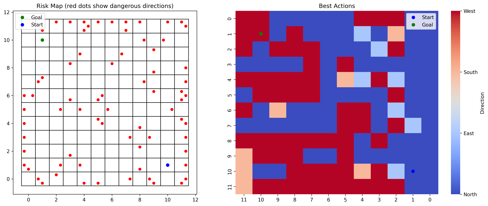

# EK-Webots-Q-Learning
---
# Author: Evgenii Korolev  
# Updated: 2024-07-03  
image: /q_table_heatmap.png
---

# EK-Webots-Q-Learning

A simulation project in Webots where the Khepera III robot learns autonomous navigation using Q-Learning. The robot avoids obstacles and finds optimal paths to a goal through exploration and reinforcement learning.

<!-- more -->

## Overview

This repository contains code and assets for training a simulated Khepera III robot to navigate a 12x12 grid using Q-Learning. The system uses sensors, GPS, compass, and a reward structure to reinforce optimal movements and penalize collisions or inefficiency.

---

## 📦 Files Included

| File | Description |
|------|-------------|
| `khepera_qlearning.py` | Main training script using Q-learning |
| `khepera_best_path.py` | Best path executor using learned Q-table |
| `Q-Table Visualizer.py` | Generates heatmap and best-actions visualization |
| `q_table_heatmap.png` | Example heatmap of learned Q-values |
| `q_table_readable.xlsx` | Q-table exported to Excel for manual analysis |
| `Khepera3.proto` | Webots robot definition |
| `INSTRUCTIONS.txt` | Instructions for simulation setup |
| `README.md` | This documentation |

---

## 🧠 Key Concepts

- **Q-Learning** with discrete state-action representation.
- **12x12 Grid World** with 144 positions and 4 directions (N, E, S, W).
- **Reward System**:
  - `+10` for reaching goal
  - `-10` for collisions
  - `-0.01` per step
  - `+2 * distance improvement`
  - `+0.5` exploration bonus

---

## 🦾 Robot Capabilities

- **Position Tracking** via GPS
- **Orientation Awareness** via Compass
- **Obstacle Detection** with 4 Distance Sensors
- **Motor Control** using Webots API

---

## 🔧 Technical Details

| Parameter | Value |
|----------|-------|
| Grid Size | 12 x 12 |
| Cell Size | 0.25 units |
| Actions | 0° (North), 90°, 180°, 270° |
| Speed | 10 (forward), 6 (turn) |
| Learning Rate | 0.2 |
| Discount Factor | 0.95 |
| Epsilon | 0.3 → 0.05 (decay) |
| Steps/Episode | max 500 |

---

## 🧪 How to Run

1. **Install dependencies**:
    ```bash
    pip install numpy matplotlib pandas seaborn
    ```

2. **Run the Q-learning training**:
    ```bash
    python khepera_qlearning.py
    ```

3. **Visualize results**:
    ```bash
    python Q-Table\ Visualizer.py
    ```

4. **Replay best path**:
    ```bash
    python khepera_best_path.py
    ```

> Make sure Webots is installed and the `Khepera3.proto` is properly loaded in your simulation world.

---

## 📊 Visualization



- **Left**: Red dots indicate risky (negative-rewarded) directions.
- **Right**: Heatmap shows the best action in each cell using Q-values.

---

## ⚠️ Known Limitations

- Sensor readings can overlap under tight obstacle configurations.
- Q-learning requires many episodes for convergence due to sparse rewards.
- Specific tuning of epsilon decay and reward balance is required for stability.

---
